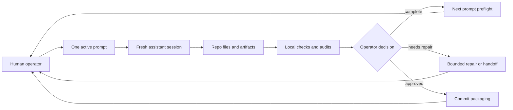

# agent-harness-lab

`agent-harness-lab` is a human-assisted harness design lab for coordinating
prompt-bounded coding-agent work. It focuses on the operating model around
modern subscription-level assistants such as Codex, Claude Code, Gemini, and
similar tools: how a human operator starts work, assigns a bounded prompt,
validates results, hands off context, and resets for the next fresh session.

The project is meant to become an execution substrate for repeatable assistant
work, not a large autonomous agent platform. Its early center of gravity is
plain markdown, templates, runbooks, small scripts, inspectable reports, and
validation gates. Heavier runtime automation can only earn its place after the
human workflow is explicit and stable.

## Quick Orientation

If you are new to the repo, read in this order:

1. `README.md` for identity, boundaries, and current status.
2. `docs/architecture/mental-model.md` for the one-screen workflow map.
3. `docs/operator-start.md` if you are the human operator.
4. `AGENT.md` if you are starting an assistant session.
5. `docs/README.md` only when you need the full documentation index.

The shortest mental model is: AHL keeps prompt-bounded work explicit. A human
operator chooses one prompt, an assistant executes it in a fresh session, local
helpers inspect files and produce artifacts, and the operator decides whether
the result is complete, needs repair, or should be committed.



| Need | Start here |
| --- | --- |
| Understand what AHL is | `README.md` and `docs/architecture/mental-model.md` |
| Run one prompt manually | `docs/operator-start.md` and `runbooks/fresh-session-prompt-run.md` |
| Start an assistant session | `AGENT.md` |
| Check local health | `make help`, then `make doctor`, `make check-docs`, and `make test` |
| Use AHL from another repo | `docs/portable-operator/README.md` |
| Review limits before relying on it | `docs/known-limitations.md` |

## What This Is

- A lab for fresh-session prompt execution and session choreography.
- A place to define role boundaries, handoff formats, validation routines, and
  operator habits.
- A repository for durable artifacts that can be reviewed in git.
- A substrate for small, dependency-light helper scripts once the workflow
  proves that scripts are needed.

## What This Is Not

- It is not a clone of `agent-context-base`, `pi-mono`, or `claw-code`.
- It is not a provider-specific runtime or API integration layer.
- It is not a full autonomous coding-agent platform.
- It is not a memory product where raw assistant chatter becomes trusted state.

## Why Human-Assisted Orchestration Matters

Current coding assistants are powerful, but the durable value often comes from
how the human operator frames the work, limits the session, audits the result,
and decides what context is worth preserving. This repo treats the human as the
orchestrator of work, not as a passive observer of an autonomous system.

That posture keeps the workflow compatible with subscription tools and local
CLIs. It also makes failure modes easier to inspect: prompts, docs, runbooks,
reports, and git history remain the source of truth.

## Why Fresh Sessions Are Central

Each prompt should be executable in a fresh assistant session with enough local
context to do the job and enough constraints to stop scope drift. Fresh sessions
reduce hidden context dependence, force durable handoffs when they are actually
needed, and make the promptset easier to audit.

The intended loop is:

1. Start from the repo state and the next prompt.
2. Execute one bounded prompt.
3. Audit the deliverables and validation evidence.
4. Preflight the next prompt.
5. Leave a bridge handoff only when it materially helps.
6. Reset into a fresh session for the next prompt.

## Assistant Usage

The workflow is designed to run in subscription-level coding assistants, local
assistant CLIs, or manual copy/paste chat sessions without making any provider
mandatory. See `docs/assistants/README.md` for practical guides covering
Codex, Claude Code, Gemini, Pi, generic chat workflows, subscription-friendly
operation, and context loading.

## Reference Repos

Local clones of `agent-context-base`, `pi-mono`, and `claw-code` may sit beside
or inside a working copy as reference material. They are influences, not parent
projects.

- `agent-context-base` contributes useful ideas around deterministic startup,
  explicit context files, drift checks, validation gates, and memory promotion
  discipline.
- `pi-mono` contributes useful ideas around a minimal harness surface,
  extensible skills, prompt templates, and adapting tools to an operator's
  workflow.
- `claw-code` contributes useful ideas around doctor/preflight checks,
  structured output, permission postures, idempotent init, and recoverable
  loops.

This repo should adapt compatible ideas without copying implementations,
vendor-specific assumptions, or project identity.

## Expected Artifact Types

As the promptset is executed, the repo is expected to grow through artifacts
such as:

- Documentation for guardrails, workflows, and operating doctrine.
- Runbooks for repeated operator routines.
- Templates for prompts, handoffs, reports, and reviews.
- Small scripts for checks, scaffolding, and repeatable local tasks.
- Examples and experiments that test the harness model.
- Findings and reports that summarize validation evidence.

The initial baseline now contains those areas in documentation-first form. The
phase-two outer-loop baseline adds bounded local planning, dry-runs, gate
reports, run ledgers, manual-driver rehearsal, explicit one-step live runner
support for verified local driver contracts, resume helpers, and conservative
commit planning/execution boundaries.

## Operating Baseline

The initial baseline for Prompts 01 through 32 is recorded in
`docs/capstone/operating-baseline.md`, with final audit evidence in
`docs/capstone/final-audit.md` and a completion report in
`docs/capstone/promptset-completion-report.md`. Future work is tracked as
backlog in `docs/capstone/future-backlog.md`, not as implemented capability.
Phase-two outer-loop requirements, safety boundaries, capstone audit, and
operating baseline live in `docs/outer-loop/`. The current outer-loop helper
can plan batches, dry-run plans, collect gates, build prompt payloads and run
ledgers, rehearse manual-driver runs, plan resumes, generate commit plans, and
perform explicit one-step live CLI invocation only through `outer run --execute`
for supported local driver contracts.

Prompts 42 through 53 add a portable-operator baseline for calling AHL from
arbitrary project repos with their own `.prompts/` directory. The supported
portable namespace is `project locate/status`, `lifecycle
snippets/context-check/run-range`, `commit check`, and `portable rehearsal`.
It keeps the human operator as scheduler, reviewer, validation authority, and
commit authority.

Release-readiness guidance lives in `docs/release-readiness.md`, with current
limitations in `docs/known-limitations.md`, maintenance guidance in
`docs/maintenance.md`, and contribution guidance in `docs/contributing.md`.
The project is usable as a human-assisted lab when local structural checks pass
and limitations are stated honestly; this is not a production-readiness claim.

## Running The Promptset

At a high level, an operator should run the promptset one prompt at a time in a
fresh assistant session:

1. Inspect the repo state and read the bootstrap guidance in `AGENT.md`.
2. Open the next `.prompts/PROMPT_XX.txt` file.
3. Execute that prompt only.
4. Validate the required deliverables before claiming completion.
5. Check the next prompt for readiness.
6. Commit only when the operator decides the completed changes are ready.

This keeps the project inspectable and makes each session's contribution easy
to review.

## Helper Scripts

The `scripts/ahl.py` CLI provides small standard-library helpers for local
checks and scaffolding. Use it to inspect promptset numbering, run a foundation
doctor check, run a lightweight quality validation gate, check documentation
navigation, print a read-only session briefing, and create run or handoff
artifacts from templates. It supports the manual workflow; it does not run
assistants, call providers, or decide completion.

Common local checks:

```sh
make help
make doctor
make promptset
make test
make domain-pack
python3 scripts/ahl.py promptset
python3 scripts/ahl.py doctor
python3 scripts/ahl.py docs check
python3 scripts/ahl.py domain-pack check
python3 scripts/ahl.py validate
python3 scripts/ahl.py portable rehearsal --json
python3 -m unittest tests/test_ahl.py
```

The Makefile is a concise operator console for stable, common actions. Direct
`python3 scripts/ahl.py ...` calls remain the right choice for JSON output,
extra arguments, and scaffold commands that are intentionally not exposed as
routine targets.

Quality guidance lives in `docs/quality/`. Those docs define validation gates,
promptset quality, audit protocol, severity, completion states, and failure
classification without replacing prompt-specific judgment.

## Current Status

This repository has public identity, assistant bootstrap guidance, assistant
usage guides, navigation docs, guardrails, safety and permission guidance,
doctrine, roles, skills, routines, runtime lifecycle notes, memory governance,
contracts, templates, runbooks, examples, quality guidance, metadata rules,
final capstone baseline docs, future-facing architecture guidance, and
lightweight helper scripts. It also has phase-two outer-loop planning,
dry-run, gate, dry-run-default live-runner, resume, recovery, Pi adapter, and
commit-planning helpers, plus portable operator helpers for status, snippets,
context checks, run-range dry-runs, commit inspection, fixtures, and
rehearsal. It does not have provider credentials, graph or vector database
dependencies, an autonomous daemon, or a production orchestration runtime.
