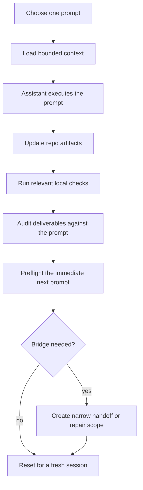
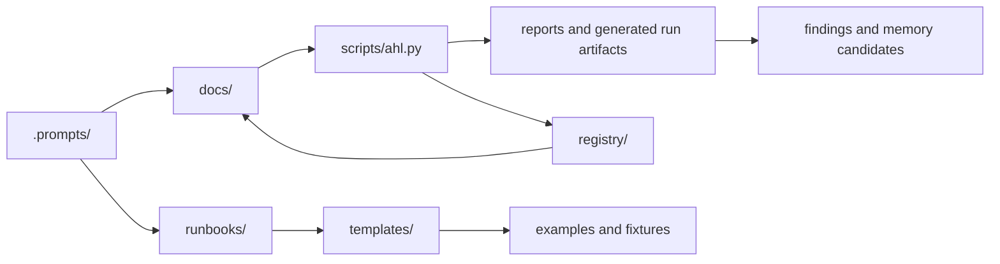

# Mental Model

This page is the fast visual map for `agent-harness-lab`. It explains the
current workflow without requiring a new reader to absorb the full docs index.

## Core Loop

AHL is built around one prompt at a time. The human operator remains the
scheduler, reviewer, validation authority, and commit authority.

## Artifact Map

## Current Capability Boundaries

| Area | Current shape | Boundary |
| --- | --- | --- |
| Prompt execution | Manual, one fresh session at a time. | AHL does not choose work or claim semantic completion. |
| Helper CLI | Dependency-free local checks, scaffolds, dry-runs, gates, ledgers, portable snippets, and commit inspection. | Live assistant invocation is limited to explicit `outer run --execute` with supported local driver contracts. |
| Portable operator | Read-only project status, snippets, context checks, run-range dry-runs, commit checks, and rehearsal fixtures. | It does not edit target projects, schedule continuation, or run portable prompts. |
| Outer loop | Local planning, dry-run, payload, gate, resume, recovery, and guarded live-run support. | It is not a daemon, model router, queue worker, or autonomous platform. |
| Memory | Reviewed promotion candidates and decision records. | Raw transcripts and scratch notes are not durable memory. |

Use `docs/known-limitations.md` for the full list of limits and
`docs/release-readiness.md` for the checks expected before treating the repo as
usable.
